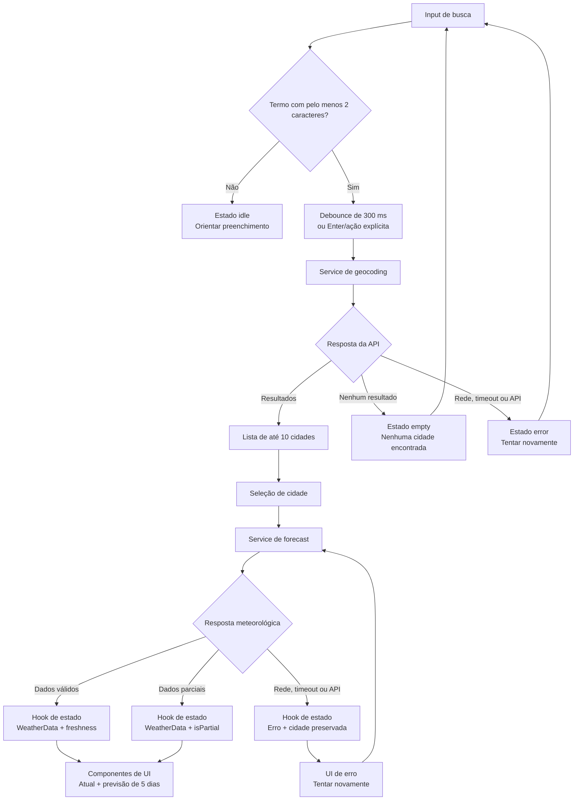

# Plano Técnico — Weather App

Este plano deriva de `specs/weather-app-spec.md`, que é a fonte da verdade do
MVP. Os identificadores `RF`, `AC` e `RNF` abaixo referenciam os requisitos da
especificação e devem ser preservados nas tarefas e nos testes.

## Architecture

Arquitetura em camadas, com uma única tela e uma cidade ativa por vez:

```text
App
├── SearchBar + SearchResults
├── WeatherSummary + ForecastList
├── UnitToggle + freshness/status states
└── useWeather (orquestração e estado da jornada)
    ├── geocodingService (Open-Meteo geocoding)
    ├── forecastService (Open-Meteo forecast)
    └── lib (conversão, códigos WMO, datas e validação)
```

- **Apresentação:** componentes React recebem dados já normalizados e emitem
  eventos de busca, seleção, retry e troca de unidade.
- **Orquestração:** `useWeather` controla busca com debounce, cidade
  selecionada, consulta meteorológica, concorrência e estados da experiência.
- **Dados externos:** serviços independentes encapsulam URLs, parâmetros,
  timeout, parsing e erros da Open-Meteo. Componentes não conhecem endpoints.
- **Funções puras:** conversão Celsius/Fahrenheit, seleção dos cinco dias,
  mapeamento de códigos WMO e formatação pt-BR ficam em `lib/`.

Dependências permitidas entre camadas:

```text
components -> hooks -> services
components -> lib
hooks -> lib
services -> types
services -> lib (somente normalização/parsing compartilhável)
types -> nenhuma camada
```

`components` não acessa `fetch`, URLs ou respostas brutas da API. `services` não
conhece componentes nem estado React. `lib` não produz efeitos colaterais e
`types` contém somente contratos compartilhados. Essa divisão atende RF01–RF08,
RNF02–RNF05 e RNF08, mantendo o escopo de uma cidade e sem introduzir store
global ou backend próprio.

Essa separação também define fronteiras de teste: componentes podem receber
props e mocks do hook; o hook pode mockar os serviços; os serviços podem testar
requests e payloads com `fetch` mockado; e `lib` pode ser validada com testes
unitários puros, sem DOM, rede ou relógio real.

## Tech Stack

- **TypeScript strict + React:** contratos explícitos, componentes acessíveis e
  estado local da jornada. O `strict` reduz falhas ao lidar com respostas
  parciais (RNF03, RF07).
- **Vite:** build e servidor de desenvolvimento já adotados pelo projeto,
  adequados para uma aplicação web estática sem servidor de aplicação.
- **Tailwind CSS:** layout responsivo mobile-first e estados visuais
  consistentes entre 320 px e 1440 px (RNF01).
- **Open-Meteo:** geocoding e forecast sem API key, conforme a decisão de
  produto. Nenhum segredo é enviado ao cliente (RF01, RF03, RNF06).
- **Vitest + Testing Library:** testes rápidos de funções, serviços e jornada
  React; **Playwright** para fluxos reais e matriz de viewport (RNF03, RNF07).
- **Biome + pnpm:** lint, formatação e instalação alinhados ao repositório.

Não será adicionada biblioteca de gerenciamento de estado, cliente HTTP ou
design system: `fetch`, React e helpers locais cobrem o MVP sem over-engineering.

## Project Structure

```text
src/
├── components/
│   ├── SearchBar.tsx         # entrada e ação explícita de busca
│   ├── SearchResults.tsx     # lista e seleção acessível de City
│   ├── WeatherSummary.tsx    # clima atual e atualização
│   ├── ForecastList.tsx      # cinco ForecastDay
│   ├── UnitToggle.tsx        # seleção de celsius/fahrenheit
│   └── states/               # loading, empty, error, unavailable, partial
├── hooks/
│   └── useWeather.ts         # coordenação da jornada e estado
├── services/
│   ├── geocodingService.ts   # Open-Meteo geocoding -> City[]
│   └── forecastService.ts    # Open-Meteo forecast -> WeatherData
├── lib/
│   ├── temperature.ts        # conversão sem erro acumulado
│   ├── weatherCodes.ts       # código WMO -> texto/ícone complementar
│   ├── dateTime.ts           # timezone da cidade + pt-BR
│   └── weatherValidation.ts  # normalização e parcialidade
├── types/
│   ├── city.ts
│   ├── weather.ts
│   └── service.ts
├── styles/
│   └── globals.css
├── App.tsx
└── main.tsx
```

Responsabilidades e contratos principais:

- `components/` recebe estado pronto para renderização e dispara eventos
  sem conhecer transporte ou formato da Open-Meteo. Cada componente deve
  permanecer focado em apresentação, acessibilidade e interação local.
- `hooks/` combina estado de busca, cidade selecionada, forecast, unidade,
  cache, retry e concorrência. É o único ponto que coordena efeitos React da
  jornada.
- `services/` constrói URLs, executa `fetch`, aplica timeout/abort, interpreta
  HTTP/JSON e normaliza dados externos para os tipos internos. URLs não vazam
  para a UI.
- `lib/` contém funções determinísticas para conversão, datas, códigos WMO,
  limite de cinco dias e validação de parcialidade. Não importa React nem faz
  requests.
- `types/` concentra interfaces e tipos compartilhados, evitando contratos
  duplicados entre componentes, hooks e serviços.

Logs e métricas, quando adicionados, recebem somente eventos técnicos
agregados, sem registrar texto de busca desnecessariamente (RNF06, RNF08).

Restrições transversais que a implementação e os testes devem preservar:

- **RNF01:** reservar dimensões estáveis para loading, resultados e cartões de
  previsão, evitando deslocamento inesperado e mantendo CLS inferior a 0,1;
- **RNF02:** medir os marcos de primeira tela utilizável, resultados de busca e
  forecast para verificar os limites p95 da spec, sem transformar latência de
  provedor em teste unitário frágil;
- **RNF03:** aplicar WCAG 2.2 AA, foco visível, operação por teclado, nomes
  acessíveis, `aria-live` e contraste mínimo de 4,5:1 para texto normal e 3:1
  para texto grande;
- **RNF06:** renderizar termos e mensagens como texto, nunca como HTML vindo da
  busca ou da API, e não registrar entradas completas nos logs;
- **RNF07:** validar a jornada nos dois últimos releases estáveis de Chrome,
  Edge, Firefox e Safari, incluindo Chrome Android e Safari iOS;
- **RNF08:** emitir métricas agregadas para falhas de busca/forecast, latência e
  conversão, sem dados pessoais desnecessários.

## Data Model

Os serviços convertem respostas externas para um modelo interno estável. A
temperatura permanece em Celsius até a camada de apresentação, permitindo a
troca de unidade sem novo request e sem arredondamento acumulado (AC13–AC16).

```ts
type Unit = 'celsius' | 'fahrenheit';

interface City {
  id: number;
  name: string;
  country: string;
  countryCode?: string;
  admin1?: string;
  latitude: number;
  longitude: number;
  timezone?: string;
}

interface CurrentWeather {
  temperatureCelsius?: number;
  weatherCode?: number;
  observedAt?: string;      // Data/hora local ISO 8601 retornada pela fonte
}

interface ForecastDay {
  date: string;              // YYYY-MM-DD no timezone da cidade
  temperatureMinCelsius?: number;
  temperatureMaxCelsius?: number;
  weatherCode?: number;
}

interface WeatherData {
  city: City;
  current: CurrentWeather;
  forecast: ForecastDay[];  // exatamente cinco itens quando completo
  timezone: string;
  fetchedAt: string;         // instante de recebimento, ISO 8601
  isPartial: boolean;
}

interface SearchState {
  query: string;
  status: 'idle' | 'loading' | 'success' | 'empty' | 'error';
  results: City[];
  error?: AppError;
}

interface WeatherState {
  selectedCity?: City;
  status: 'idle' | 'loading' | 'success' | 'error' | 'unavailable';
  data?: WeatherData;
  freshness: 'current' | 'stale' | 'unavailable';
  error?: AppError;
}

interface AppError {
  kind: 'network' | 'timeout' | 'http' | 'invalid-data' | 'unknown';
  messageKey: string;
  retryable: boolean;
}
```

Regras do contrato:

- `City.id`, latitude e longitude da seleção são usados no forecast; o texto
  digitado nunca substitui a localidade escolhida (AC06–AC08).
- Campos meteorológicos opcionais representam ausência real. A UI mostra
  “Indisponível”; não há valores estimados. `isPartial` é verdadeiro se algum
  campo necessário estiver ausente (AC23).
- A UI calcula `round(C * 9 / 5 + 32)` para Fahrenheit e arredonda Celsius
  somente na exibição. O modelo não guarda o valor convertido.
- A previsão normalizada deve conter exatamente cinco itens para o estado
  completo; uma resposta com menos itens é parcial e não deve ser apresentada
  como completa (AC11–AC12, AC23).

## Data Flow



1. `SearchBar` mantém o texto controlado e envia a busca quando há pelo menos
   dois caracteres após 300 ms de inatividade, ou imediatamente em Enter/botão
   (RF01, AC01–AC04).
2. `useWeather` cancela o debounce e a requisição anterior quando necessário,
   chama `geocodingService.search(query)` e limita/ordena os resultados para no
   máximo 10 por relevância e localidade.
3. `SearchResults` apresenta cidade, país e região quando disponível; a
   seleção envia o objeto `City`, não apenas o texto (RF02, AC03, AC06–AC07).
4. O hook preserva a cidade selecionada, consulta
   `forecastService.getForecast(city)` e descarta respostas cujo request-id
   não seja o mais recente. Assim uma consulta antiga não sobrescreve a nova.
5. O serviço valida e normaliza o payload, seleciona hoje e os quatro dias
   seguintes usando o timezone fornecido e retorna `WeatherData` parcial quando
   aplicável.
6. `WeatherSummary` e `ForecastList` renderizam o modelo em Celsius ou
  Fahrenheit conforme `Unit`; a troca só recalcula apresentação.
7. `dateTime` formata data/hora em pt-BR no timezone da cidade e o hook calcula
  a idade do timestamp da fonte (`current.observedAt`) para `current` ou
  `stale`; `fetchedAt` serve apenas para auditoria do recebimento.
8. Em nova busca, o fluxo volta a permitir seleção sem desmontar a aplicação;
   erros de forecast preservam a cidade e o contexto para retry (RF08, AC24–25).

## External APIs

### Geocoding

`GET https://geocoding-api.open-meteo.com/v1/search`

Parâmetros definidos pelo plano:

- `name`: termo normalizado, preservando acentos;
- `count=10`: limite de resultados;
- `language=pt`: nomes compatíveis com a interface quando disponíveis;
- `format=json`.

O adapter aceita `results` ausente como lista vazia, distingue resposta vazia
de falha de rede e mapeia `id`, `name`, `country`, `admin1`, `latitude`,
`longitude` e `timezone` para `City`.

Exemplo resumido de resposta:

```json
{
  "results": [
    {
      "id": 3451190,
      "name": "Rio de Janeiro",
      "latitude": -22.9068,
      "longitude": -43.1729,
      "timezone": "America/Sao_Paulo",
      "country": "Brazil",
      "country_code": "BR",
      "admin1": "Rio de Janeiro"
    }
  ],
  "generationtime_ms": 0.2
}
```

Mapeamento para `City`: `id`, `name`, `country`, `country_code`, `admin1`,
`latitude`, `longitude` e `timezone` são copiados para os campos equivalentes;
`country_code`, `admin1` e `timezone` permanecem opcionais quando a fonte não os
retornar. `generationtime_ms` é metadado da API e não entra no modelo interno.

### Forecast

`GET https://api.open-meteo.com/v1/forecast`

Parâmetros definidos pelo plano:

- `latitude` e `longitude` da `City` selecionada;
- `current=temperature_2m,weather_code`;
- `daily=weather_code,temperature_2m_max,temperature_2m_min`;
- `temperature_unit=celsius`;
- `timezone=auto`;
- `forecast_days=5`.

O adapter valida `current`, `daily.time`, os vetores diários e `timezone`,
aceitando vetores incompletos como resposta parcial. Requisições têm timeout
explícito e `AbortSignal`; não haverá API key no cliente. A versão inicial não
usa forecast horário nem campos fora do escopo (RF03–RF06, R04).

Exemplo resumido de resposta:

```json
{
  "latitude": -22.91,
  "longitude": -43.17,
  "timezone": "America/Sao_Paulo",
  "current": {
    "time": "2026-09-16T10:00",
    "temperature_2m": 24.3,
    "weather_code": 2
  },
  "daily": {
    "time": ["2026-09-16", "2026-09-17", "2026-09-18", "2026-09-19", "2026-09-20"],
    "temperature_2m_min": [19.1, 18.7, 20.0, 21.2, 20.4],
    "temperature_2m_max": [27.5, 26.8, 28.1, 29.0, 27.9],
    "weather_code": [2, 3, 1, 61, 80]
  }
}
```

Mapeamento para o modelo interno:

- `current.temperature_2m` -> `WeatherData.current.temperatureCelsius`;
- `current.weather_code` -> `WeatherData.current.weatherCode`;
- `current.time` -> `WeatherData.current.observedAt`;
- cada índice `i` de `daily.time` -> `ForecastDay.date`;
- `daily.temperature_2m_min[i]` -> `ForecastDay.temperatureMinCelsius`;
- `daily.temperature_2m_max[i]` -> `ForecastDay.temperatureMaxCelsius`;
- `daily.weather_code[i]` -> `ForecastDay.weatherCode`;
- `timezone` -> `WeatherData.timezone`;
- a `City` selecionada -> `WeatherData.city`;
- o instante de recebimento do cliente -> `WeatherData.fetchedAt`;
- `isPartial` -> `true` se algum campo esperado estiver ausente ou se houver
  menos de cinco itens diários válidos.

Os vetores `daily.*` são correlacionados pelo mesmo índice. O normalizador
seleciona os cinco primeiros dias retornados, que devem corresponder a hoje e
os quatro dias seguintes no timezone da resposta. Valores ausentes tornam
somente o campo correspondente indisponível; não são substituídos por zero ou
por estimativas.

Os códigos WMO são convertidos localmente em condição textual em pt-BR; um
ícone, quando usado, é apenas complementar ao texto. A ordenação do geocoding
preserva a relevância retornada pela Open-Meteo e usa nome/localidade como
desempate antes de limitar a lista a 10 resultados.

## State Management

O estado vive em `useWeather`, consumido por `App`; não há estado global porque
o produto exibe uma única cidade e a unidade vale apenas durante a sessão.

- `search`: query, resultados, status e erro da geocodificação.
- `weather`: cidade ativa, dados, status, freshness e erro do forecast.
- `unit`: `Unit` com `'celsius'` inicial; permanece em memória até o reload e não usa
  `localStorage` (RF05, AC14–AC16).
- `requestId`/`AbortController`: controle de concorrência e cancelamento de
  requests obsoletos (edge case de consulta durante carregamento).
- `cache`: mapa em memória indexado por `City.id`, com `WeatherData` e
  `fetchedAt`. Pode fornecer fallback dentro de 30 minutos, sempre sinalizado
  como “Desatualizado”; entradas mais antigas não preenchem a tela (RF06,
  RNF04–RNF05).

Updates relacionados a uma nova cidade substituem o conteúdo meteorológico
somente quando o request correspondente à seleção atual termina.

Estados explícitos por operação:

| Estado | Busca (`search`) | Meteorologia (`weather`) |
| --- | --- | --- |
| `idle` | Nenhuma busca executada ou termo ainda menor que dois caracteres. | Nenhuma cidade selecionada; orientar o usuário a pesquisar. |
| `loading` | Geocoding em andamento; preservar o termo e indicar progresso. | Forecast em andamento; preservar a cidade selecionada e indicar progresso. |
| `success` | Resultados disponíveis, ou dados meteorológicos válidos para renderização. | Dados atuais e previsão carregados; `forecast` completo tem cinco itens. |
| `empty` | Nenhuma cidade corresponde ao termo; não é erro de comunicação. | Não usado para uma resposta meteorológica válida; ausência de dados usa `unavailable`. |
| `error` | Falha de rede, API, timeout ou payload inválido; oferecer nova busca/retry. | Falha do forecast; preservar a cidade e oferecer retry. |

`partial` não substitui `success`/`error`: é uma propriedade de `WeatherData`
(`isPartial`) e pode acompanhar `success` quando há dados utilizáveis, mas
campos ou dias ausentes. `freshness` complementa o status com `current`,
`stale` ou `unavailable`.

### Conversão derivada na renderização

O serviço sempre solicita e normaliza `temperature_unit=celsius`. O hook mantém
somente `unit` como preferência de apresentação, e componentes ou um helper
  puro calculam os valores exibidos a partir de `temperatureCelsius`:

```text
displayTemperature(celsius, 'celsius')    = round(celsius)
displayTemperature(celsius, 'fahrenheit') = round(celsius * 9 / 5 + 32)
```

O mesmo helper é aplicado à temperatura atual e às mínimas/máximas de cada
`ForecastDay`. A alteração de `unit` atualiza apenas o estado local e provoca
nova renderização; não altera `WeatherData`, não acumula arredondamentos e não
faz nova busca de cidade ou request meteorológico (AC13–AC16). A unidade ativa
deve aparecer no controle e junto dos valores exibidos, atendendo AC09–AC10.

## Error Handling

Cada operação tem estados visíveis e semanticamente distintos:

- **Idle/vazio:** início sem cidade orienta a pesquisar; busca vazia ou com
  menos de dois caracteres não chama a API.
- **Loading:** indicador com texto acessível, preservando o contexto da busca ou
  cidade enquanto a operação está em andamento (AC19, RNF03).
- **Empty:** geocoding sem resultados informa “Nenhum resultado encontrado” e
  orienta alterar o termo; não é tratado como indisponibilidade (AC05, AC21).
- **Error:** timeout, HTTP, rede ou payload inválido informam indisponibilidade
  e oferecem “Tentar novamente”. Erro de geocoding permite nova busca; erro de
  forecast preserva a cidade selecionada (AC08, AC20, AC25).
- **Partial/unavailable:** campos ausentes mostram “Indisponível” e o bloco de
  previsão informa “Previsão parcial”. Sem dados atuais válidos, o layout não
  inventa valores. Cache de até 30 minutos pode ser mostrado como desatualizado;
  cache expirado resulta em indisponível.
- **Abort/corrência:** cancelamentos esperados não geram alerta de erro. O
  timeout/rede encerra o loading e mantém retry disponível.

Categorias de falha e decisão de recuperação:

| Categoria | Detecção | Comportamento |
| --- | --- | --- |
| Rede | `fetch` rejeitado, perda de conexão ou DNS. | Encerrar `loading`, preservar o contexto, exibir indisponibilidade e oferecer “Tentar novamente”. |
| API | HTTP não-2xx, limite excedido ou erro retornado pela Open-Meteo. | Classificar como erro recuperável, registrar status técnico sem dados pessoais e permitir retry. |
| Timeout | `AbortController` encerra a chamada após o limite definido. | Não bloquear a interface; exibir mensagem de tempo excedido e permitir nova tentativa. |
| Resposta inválida | JSON incompatível, campos obrigatórios ausentes ou vetores inconsistentes. | Marcar `invalid-data`; exibir campos válidos como disponíveis e os demais como “Indisponível”, quando a normalização for segura; caso contrário, exibir erro. |
| Resposta parcial | Alguns campos ou dias faltam, mas há dados correlacionáveis. | Produzir `WeatherData` com opcionais ausentes, `isPartial: true` e aviso “Previsão parcial”; nunca inventar valores. |

Uma falha de geocoding não apaga a cidade meteorológica já exibida. Uma falha
de forecast mantém a cidade selecionada para que o retry use latitude,
longitude e `City.id` originais. Cache válido por até 30 minutos pode ser usado
como fallback claramente marcado como `stale`; cache expirado não é exibido.

Mensagens são em pt-BR, anunciadas via regiões `aria-live` e não dependem só de
cor ou ícone. O timeout, status HTTP, latência e falha de conversão podem ser
medidos sem incluir query ou coordenadas completas nos logs (RNF03, RNF06,
RNF08).

## Testing Strategy

### Unitários e componentes (Vitest + Testing Library)

- **Funções puras (`lib/`):** conversão Celsius/Fahrenheit com negativos, zero,
  arredondamento e alternâncias repetidas; formatação pt-BR no timezone da
  cidade; mapeamento dos códigos WMO; seleção de hoje mais quatro dias e
  identificação de parcialidade (AC11–AC16, AC23, R05).
- **Services (`services/`):** mockar `fetch` para verificar URL e parâmetros,
  limite de 10 resultados, mapeamento geocoding, normalização do forecast,
  timeout, abort, HTTP não-2xx, JSON inválido, resposta vazia e distinção entre
  falha de comunicação e resposta parcial. Nenhum teste unitário dependerá da
  rede Open-Meteo real.
- **`useWeather`:** debounce de 300 ms, Enter imediato, retry, cancelamento e
  descarte de resposta obsoleta, cache/freshness, preservação da cidade em erro
  e troca de unidade sem novo forecast.
- **Componentes (Testing Library):** renderização e interação por teclado,
  nomes acessíveis, foco, `aria-live` e estados `idle`, `loading`, `empty`,
  `error`, `success`, `partial` e `unavailable`. Validar que “Tentar
  novamente”, “Nenhum resultado” e “Indisponível” aparecem no contexto correto.

Cada grupo deve testar comportamento observável e contratos públicos; detalhes
internos de implementação do hook ou do componente não são alvo dos testes.

### E2E (Playwright)

Usar interceptação de rede com fixtures determinísticas para cobrir os fluxos
dos AC01–AC25, mantendo os testes independentes da disponibilidade da API:

- buscar, desambiguar e selecionar uma cidade;
- exibir atual + exatamente cinco dias;
- alternar unidade sem nova chamada meteorológica;
- exibir vazio, falha, retry, resposta parcial e cache desatualizado;
- selecionar outra cidade durante carregamento e confirmar que a resposta
  antiga não vence;
- operar busca e unidade por teclado.

Executar os fluxos críticos em viewports de 320 px (mínimo), 768 px (tablet) e
1440 px (desktop), verificando ausência de rolagem horizontal, controles
acessíveis e conteúdo estável. Repetir a jornada principal nos navegadores e
mobile browsers priorizados por RNF07. Validação de entrega: `pnpm lint`,
`pnpm build`, `pnpm test` e `pnpm test:e2e`. Métricas de latência e auditorias
completas de acessibilidade devem ser checadas separadamente, sem transformar
metas de p95 em testes frágeis de unidade.

## Risks & Trade-offs

| Decisão | Alternativa considerada | Motivo da escolha e consequência |
| --- | --- | --- |
| Vitest para funções, services e componentes; Playwright para jornada. | Fazer todos os testes via E2E. | A separação torna testes unitários rápidos e diagnósticos, enquanto o E2E valida integração real. Exige manter fixtures e alguns cenários duplicados. |
| Mockar `fetch` nos testes de services. | Chamar a Open-Meteo durante os testes. | Evita flakiness, quota e dependência de rede; reduz a cobertura do contrato externo real, mitigada por validação manual/monitoramento. |
| Fixtures de rede no Playwright. | Usar a API real nos E2E. | Garante reprodução de erros, timeouts e respostas parciais; não detecta automaticamente mudanças futuras do provedor. |
| Estado local em `useWeather`. | Redux, Context global ou outra store. | Há uma cidade e uma tela no MVP; menos dependências e menor superfície de estado. Uma expansão para múltiplas telas pode exigir revisão. |
| Celsius como fonte interna e conversão na renderização. | Solicitar novamente o forecast ao alternar unidade ou armazenar ambas as unidades. | Evita latência, quota e erro acumulado; exige manter a regra de arredondamento centralizada. |
| Cache em memória de até 30 minutos. | Sem cache ou persistência em `localStorage`. | Melhora resiliência em rede instável sem persistir dados entre sessões; dados expirados não podem ser usados e o cache é perdido ao recarregar. |
| `AbortController` + request-id para concorrência. | Aceitar respostas na ordem em que chegam. | Impede que uma resposta antiga substitua a cidade atual; exige tratar aborts esperados sem exibir falsos erros. |
| Open-Meteo consumida diretamente pelo cliente. | Backend proxy próprio. | Mantém o MVP simples e sem credenciais, mas deixa latência, disponibilidade e contrato dependentes do provedor. |
| Meta de disponibilidade mensal de 99,5%. | Implementar backend ou mecanismo de failover no MVP. | Tratar como objetivo operacional de monitoramento e comunicação de degradação; failover fica fora do escopo para evitar infraestrutura sem requisito de produto. |
| Viewports fixos de 320/768/1440 px no E2E. | Testar somente desktop ou todos os tamanhos possíveis. | Cobre os limites de produto com custo controlado; não substitui testes exploratórios em dispositivos reais. |
| Sem biblioteca adicional de acessibilidade visual ou ícones. | Adicionar design system completo. | Reduz dependências e respeita o escopo; componentes precisam manter manualmente foco, contraste e anúncios de estado. |
